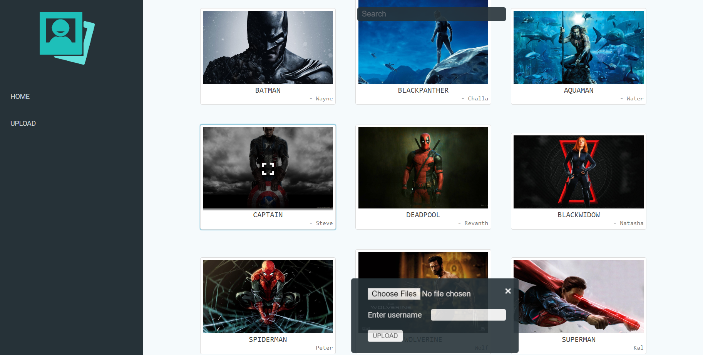

# ImageGallery
An ASP.NET Web Application to display images. It uses ASP.NET Web API to fetch and store them.

Please check snap(.png) files for the screenshots of the application!

Functionalities:
1) Image file upload - performs validations at server side for file size limit, and file type. Only after the file validations are performed the image file details are uploaded to the database.
2) Delete file - deletes file information from the database as well as the physical file
3) Search for files - search request occurs at every key press, if no results are found, it shows a sorry message.
4) Displays a status flag after each operation, for eg. if the file upload failed, it shows a flag 'File size cannot be greater than 1Mb' or 'File should be of type image'

